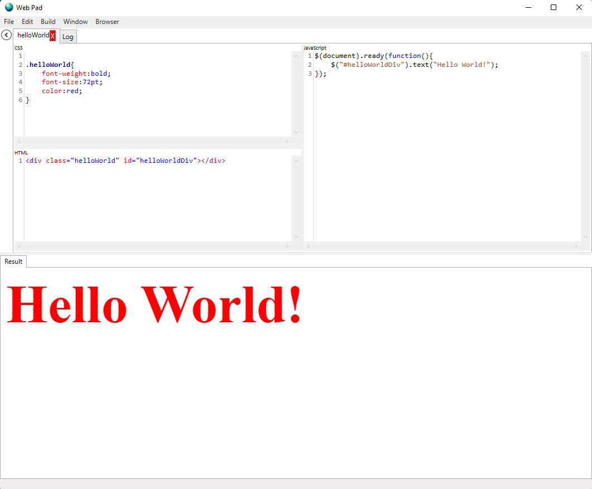

# WebPad

# History
* Sometime in 2012 I cloned code from [JQueryBudy (Codeplex)](https://jquerybuddy.codeplex.com/) and made lots of modifications to it
* 11/30/2017 I modified the code I had at the time to be distributable (Imported all the dependencies) and put it here.

# Dependencies
### For the dependencies I build the nuget packages, and then put them in a folder on my computer.  I then pull them into the WebPad Visual studio.  Some day I will put them on the nuget repo.
+ For recent files I added a dependency on sqlite using this helper library
    + https://github.com/NathanielACollier/netstandardDbSQLiteHelper
+ A dynamic dialog builder is used which comes from this place
    + https://github.com/NathanielACollier/ncWPFFormsLib